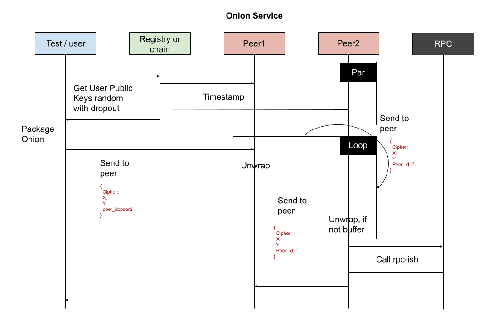

# fRPC as an Oracular Prescription
Simple rpc commands would typically work, unless a node is blocking under metaedge absolutes.

To begin our journey at Earth being one anthroprogenically with people, and to project ourselves from one planet to the next, this type of alchemical network weaving can be attuned through philosophical cosmogony inquiries into the harmonious possessed by our solar system leading to a dome of Astroprivacy enhancing remote procedure calls.

While some solutions stand to be more complex, privately, or subjectively clever via routing, this may yield a negative function limit to the manifested architecture prescribed via Oracle interpretations for compute expectation healing, or individual divine Rotator functions.

## simple 1-hop onion benchmark: an ~8% increase on networking & total user time ~3s
An initial test implementation of a 4 worker mix, that randomly chooses peers to send a mock rpc call request via a 1-hop ECIES-based onion relay. Can extend hops by wrapping particle multiple times.

### test architecture with 4 onion relay workers
```
           worker
             |
             |
worker -----hub----- worker
             |
             |
           worker
```

### sequence diagram


### how to run
```
// terminal #1
$ yarn hub:start
// pass the outputted peerId into the package.json name variable 
connected  12D3KooWSzWHkHU3iLXuTETsicaYPVyV6RewNMwUYDBTN6cspGUD

// terminal #2: start 4 worker relay cluster
$ yarn worker:simulate

// terminal #3: run tests
$ yarn user:test
```

### benchmark
Simple Aqua Call: 893.858ms
1-Hop Onion: 920.152ms
Full Onion Circuit: 3.336s

# TODOs
- tests and service definition
- if you've been in blockchain for >1 year with prior web2 knowledge, this repo is possible to complete

[influence](https://github.com/fluencelabs/fRPC-Substrate)
[art](https://codepen.io/moskalyk-the-lessful/pen/PodjXWe)
